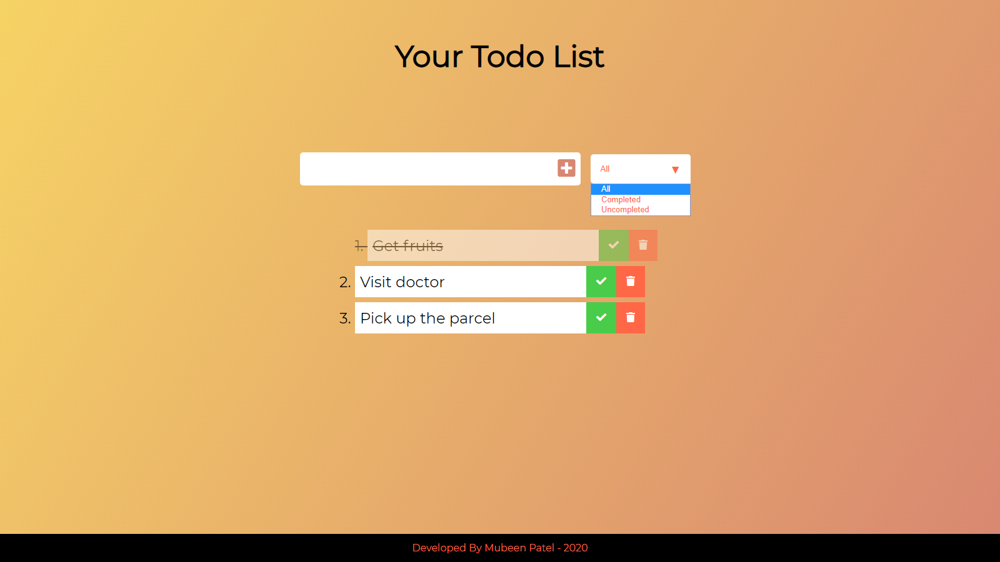

# TODO List application using vanilla JavaScript [](https://twitter.com/Patelmubeen99)
Want a solution to be more productive with work, and not to forget important stuff? this is it. There are tons of TODO management applications available but, we have something different here. This is an amazing TODO list management application built in Vanilla JavaScript.

### Want to try?
* visit
```
https://mubeenpatel99.github.io/mubeenpatel.github.io/files/ToDo/
```

### File structure
* The project file structure looks like this
```
----src
    |-- index.html
    |-- app.js
    |-- style.css
```
* **index.html** - Contains all the markdown needed.
* **style.css** &nbsp;&nbsp;&nbsp;&nbsp;- Contains all the styling.
* **app.js** &nbsp;&nbsp;&nbsp;&nbsp;&nbsp;&nbsp;&nbsp; - Here is where the majic happens, all the logic stays here.

### The features of the application
* Worried about privacy? Not any more your data stays on your device and we cant even view it, no control over your data.
* Your TODO's you are in charge, let's get productive.
* This is a beautiful todo list management application built in Vanilla JavaScript.
* Allows you to check the items in the list that are done.
* You can also delete items from the list with a sweet little animation.
* All your TODOs are stored in local storage of your browser, closed browser window by mistake no problem, we got you covered.
* Has a filter option to filter all, completed or yet to complete TODO's.
* If you use any piece of my code don't forget to mention me in the comments

### A snapshot of the application

